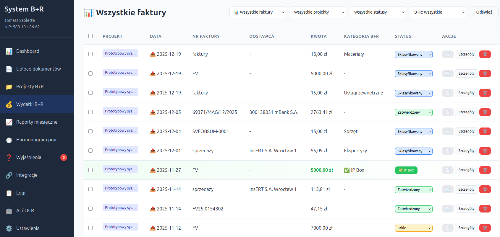
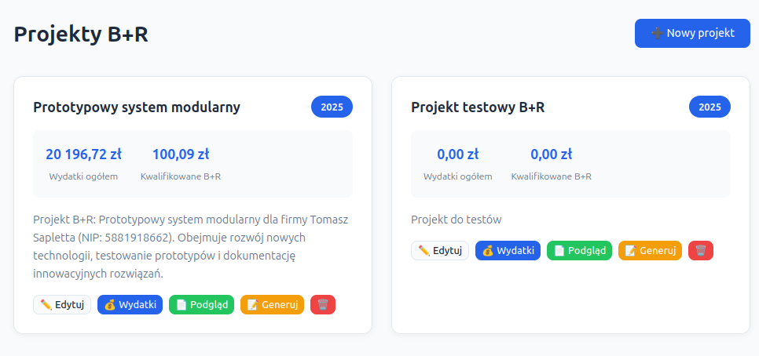
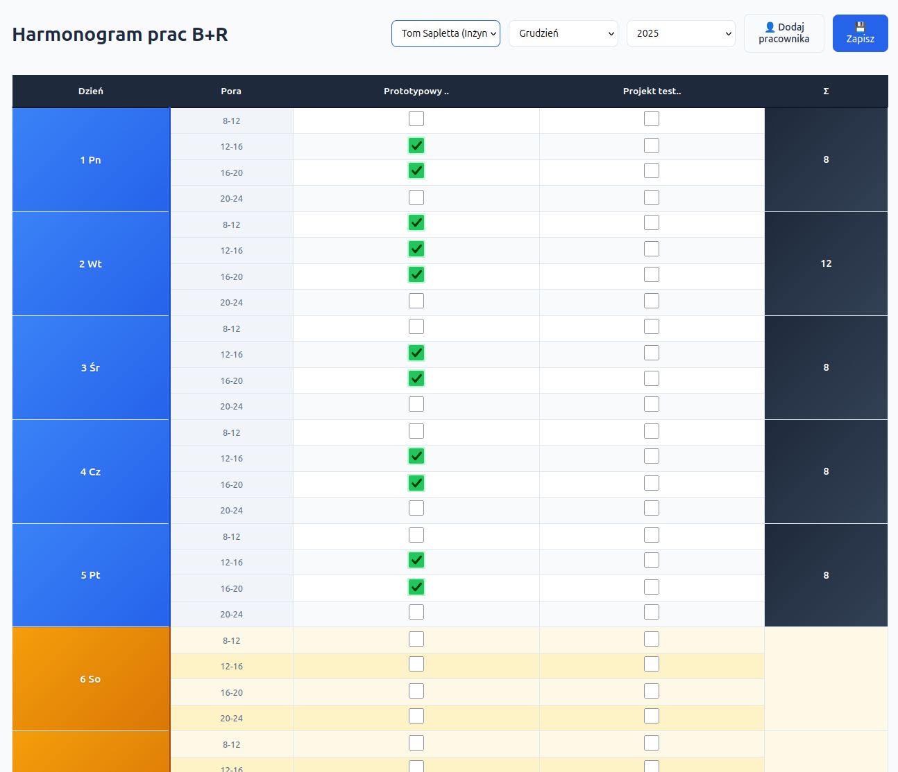
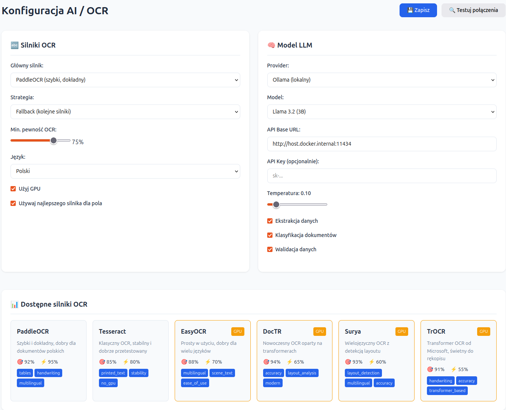

# System B+R - Prototypowy System Modularny

System automatyzacji dokumentacji B+R i IP Box dla Polskich firm

## 🎯 Funkcjonalności

- **OCR dokumentów** - automatyczne rozpoznawanie tekstu z faktur i rachunków (Tesseract + PaddleOCR z GPU)
- **Ekstrakcja danych** - NIP, kwoty, daty, numery faktur
- **Klasyfikacja B+R** - automatyczna klasyfikacja wydatków przez LLM (zgodnie z art. 26e PIT)
- **IP Box** - obliczanie wskaźnika nexus i dochodu kwalifikowanego (art. 30ca-30cb PIT)
- **Raporty miesięczne** - generowanie raportów dla US
- **System wyjaśnień** - pytania i odpowiedzi dla niejasnych dokumentów
- **Integracje księgowe** - automatyczny import z iFirma, Fakturownia, wFirma, InFakt
- **Integracje cloud** - automatyczny upload raportów do Nextcloud, Google Drive, Dropbox, OneDrive, S3
- **CQRS + Event Sourcing** - pełny audit trail dla kontroli KAS



## 🏗️ Architektura

```
┌─────────────────────────────────────────────────────────────────┐
│                         Web Interface                            │
│                      (Nginx + HTML/JS/CSS)                       │
└─────────────────────────────────────────────────────────────────┘
                                │
                                ▼
┌─────────────────────────────────────────────────────────────────┐
│                         API Backend                              │
│                  (FastAPI + CQRS + Event Sourcing)               │
└─────────────────────────────────────────────────────────────────┘
         │            │            │            │
         ▼            ▼            ▼            ▼
┌─────────────┐  ┌──────────┐  ┌──────────┐  ┌───────────────┐
│ OCR Service │  │   LLM    │  │PostgreSQL│  │ Integrations  │
│ (PaddleOCR) │  │ (LiteLLM)│  │ (Events) │  │ (Accounting + │
│ + Tesseract │  │ + Ollama │  │ + Models │  │    Cloud)     │
└─────────────┘  └──────────┘  └──────────┘  └───────────────┘
                                    │              │
                                    ▼              ▼
                              ┌──────────┐   ┌──────────────┐
                              │  Redis   │   │ Config DB    │
                              │ (Cache)  │   │ (SQLite/PG)  │
                              └──────────┘   └──────────────┘
```



## 🚀 Szybki start

### Wymagania

- Docker 24+ z Docker Compose V2
- NVIDIA GPU + nvidia-container-toolkit (opcjonalne, dla akceleracji OCR i LLM)
- 16GB RAM (zalecane)
- 20GB przestrzeni dyskowej

### Instalacja

```bash
# Klonuj repozytorium
git clone <repo-url>
cd br-system

# Utwórz plik konfiguracji
cp .env.example .env

# Wygeneruj klucz szyfrowania dla integracji
python -c "from cryptography.fernet import Fernet; print(Fernet.generate_key().decode())"
# Dodaj do .env jako CONFIG_ENCRYPTION_KEY

# Uzupełnij klucze API (opcjonalne - możesz używać tylko lokalnych modeli)
# OPENAI_API_KEY=sk-...
# ANTHROPIC_API_KEY=sk-ant-...

# Buduj i uruchom
make build
make up-gpu  # z GPU
# lub
make up      # bez GPU
```





### Dostęp

- **Web Interface**: http://localhost
- **API Docs**: http://localhost:8000/docs
- **OCR Service**: http://localhost:8001/docs
- **LLM Proxy**: http://localhost:4000
- **Flower (monitoring)**: http://localhost:5555

## 📁 Struktura projektu

```
br-system/
├── docker-compose.yml       # Definicja serwisów Docker
├── docker/                  # Dockerfiles i konfiguracje
├── config/                  # Konfiguracje zewnętrzne
├── src/
│   ├── api/                 # FastAPI Backend
│   │   ├── main.py
│   │   ├── routers/         # Endpointy API
│   │   │   ├── documents.py
│   │   │   ├── expenses.py
│   │   │   ├── projects.py
│   │   │   ├── reports.py
│   │   │   ├── clarifications.py
│   │   │   └── integrations.py  # API integracji
│   ├── integrations/        # Moduł integracji
│   │   ├── accounting/      # iFirma, Fakturownia, wFirma, InFakt
│   │   ├── cloud/           # Nextcloud, Google Drive, S3, Dropbox, OneDrive
│   │   └── config/          # Baza danych konfiguracji
│   ├── infrastructure/      # Celery, zadania asynchroniczne
│   └── ocr/                 # OCR Service
├── tests/                   # Testy (unit, integration, e2e)
├── web/                     # Frontend
├── docs/                    # Dokumentacja
│   ├── STRUCTURE.md         # Struktura plików
│   └── INTEGRATIONS.md      # Dokumentacja integracji
└── Makefile                 # Komendy make
```

## 🔌 Integracje

### Programy księgowe

| Dostawca | Status | Funkcje |
|----------|--------|---------|
| **iFirma** | ✅ | Import faktur, wydatków, PDF |
| **Fakturownia** | ✅ | Import faktur, wydatków, PDF |
| **wFirma** | ✅ | Import faktur, wydatków |
| **InFakt** | ✅ | Import faktur, GTU/PKWiU |

### Magazyny chmurowe

| Dostawca | Status | Protokół |
|----------|--------|----------|
| **Nextcloud** | ✅ | WebDAV |
| **Google Drive** | ✅ | REST API |
| **Dropbox** | ✅ | REST API |
| **OneDrive** | ✅ | Microsoft Graph |
| **AWS S3** | ✅ | S3 Protocol |
| **MinIO** | ✅ | S3 Protocol |

👉 Szczegóły: [docs/INTEGRATIONS.md](docs/INTEGRATIONS.md)

## 📊 Kategorie kosztów B+R

Zgodnie z art. 26e ustawy o PIT:

| Kategoria | Opis | Stawka odliczenia |
|-----------|------|-------------------|
| `personnel_employment` | Wynagrodzenia pracowników (umowa o pracę) | **200%** |
| `personnel_civil` | Umowy zlecenie/o dzieło | **200%** |
| `materials` | Materiały i surowce | 100% |
| `equipment` | Sprzęt specjalistyczny (niebędący ŚT) | 100% |
| `depreciation` | Odpisy amortyzacyjne | 100% |
| `expertise` | Ekspertyzy od jednostek naukowych | 100% |
| `external_services` | Usługi zewnętrzne B+R | 100% |

## 🔧 API Endpoints

### Dokumenty
- `POST /api/documents/upload` - Upload dokumentu
- `GET /api/documents/{id}` - Szczegóły dokumentu
- `GET /api/documents/` - Lista dokumentów

### Wydatki
- `POST /api/expenses/` - Dodaj wydatek
- `PUT /api/expenses/{id}/classify` - Klasyfikuj wydatek
- `POST /api/expenses/{id}/auto-classify` - Klasyfikacja LLM
- `GET /api/expenses/categories` - Lista kategorii B+R

### Raporty
- `POST /api/reports/monthly/generate` - Generuj raport miesięczny
- `GET /api/reports/annual/br-summary` - Podsumowanie B+R dla PIT/BR
- `GET /api/reports/annual/ip-box-summary` - Podsumowanie IP Box dla PIT/IP

### Integracje
- `GET /api/integrations/providers` - Dostępni dostawcy
- `POST /api/integrations/` - Dodaj integrację
- `POST /api/integrations/{id}/sync/invoices` - Synchronizuj faktury
- `POST /api/integrations/{id}/upload/report` - Wyślij raport do chmury
- `GET /api/integrations/{id}/logs` - Historia synchronizacji

### Wyjaśnienia
- `GET /api/clarifications/` - Lista pytań
- `PUT /api/clarifications/{id}/answer` - Odpowiedz na pytanie

## 🧪 Testy

```bash
# Wszystkie testy
make test

# Testy jednostkowe (szybkie)
make test-unit

# Testy integracyjne
make test-integration

# Testy E2E
make test-e2e

# Z pokryciem kodu
make test-coverage
```

## 🔒 Bezpieczeństwo

- Wszystkie dane przechowywane lokalnie (Docker volumes)
- OCR działa lokalnie (Tesseract/PaddleOCR) - bez wysyłania dokumentów do chmury
- LLM może działać w pełni lokalnie przez Ollama
- Credentials integracji szyfrowane (Fernet/AES-128)
- Event Sourcing zapewnia pełny audit trail dla KAS

## 📝 Licencja

Projekt wewnętrzny firmy Tomasz Sapletta.

## 📞 Kontakt

- Email: kontakt@prototypowy.pl
- Web: https://prototypowanie.pl
